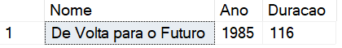
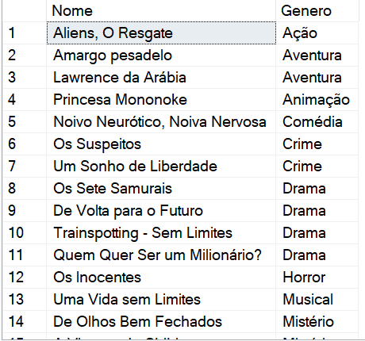

<table align="right">
 	<tr>
		<td>
			<a href="https://github.com/DevSaLLein/MySQL-Movies/blob/main/README.md">:us: English</a>
		</td>
	</tr>
 	<tr>
		<td>
			<a href="https://github.com/DevSaLLein/MySQL-Movies/blob/main/README-BR.md">:brazil: Português</a>
		</td>
	</tr>
</table>

#

# 🎞️🎬 Movies

## Project challenge
For this challenge, you will need to use your knowledge acquired in the database module of DIO's .NET track.

## Context
You are responsible for the database of a movie website, where data about movies and their actors is stored. You have therefore been asked to perform a query on the database in order to bring up some data for analysis.

## Proposal
You will need to perform 12 queries on the database, each returning a different type of information. Your database is modeled as follows:

## Database diagram

The tables are described as follows:

## Preparing the database
You will need to run the Movies.sql script file in your SQL Server database in the Scripts folder of this repository (or click here). This script will create a database called Movies, containing the tables and data you need to carry out this challenge.

## Objective
You will have to create several queries in order to return the following data. Below each request is the expected return. Your return should be the same as the image.

## 1 - Search for the name and year of movies

## 2 - Search for the name and year of the movies, sorted in ascending order by year

## 3 - Search for the movie Back to the Future, bringing up the name, year and duration

## 4 - Search for movies released in 1997

## 5 - Search for movies released AFTER the year 2000

## 6 - Search for movies with a running time greater than 100 and less than 150, sorting by running time in ascending order

## 7 - Search for the number of films released in the year, grouped by year, sorting by length in descending order

## 8 - Search for male actors, returning FirstName, LastName

## 9 - Search for female Actors, returning FirstName, LastName, and sorting by FirstName

## 10 - Search for movie name and gender

## 11 - Search for the name of the movie and the genre of the “Mystery” type

## 12 - Search for the name of the movie and the actors, bringing up the FirstName, LastName and their Role

## 📝 License
This project is under the MIT license.

⌨️ with ❤️ by DevSaLLein 😊