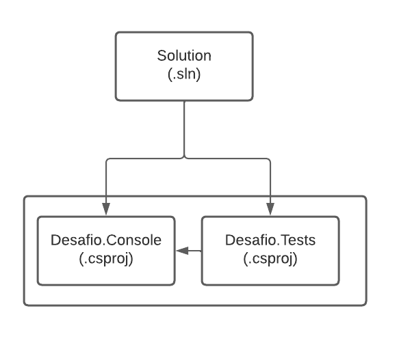

<table align="right">
 	<tr>
		<td>
			<a href="https://github.com/DevSaLLein/UnitTests-Challenge/blob/main/README.md">:us: English</a>
		</td>
	</tr>
 	<tr>
		<td>
			<a href="https://github.com/DevSaLLein/UnitTests-Challenge/blob/main/README-BR.md">:brazil: Português</a>
		</td>
	</tr>
</table>

#

# DIO - .NET Track - Unit Testing with C#
www.dio.me

## Project challenge
For this challenge, you will need to use your knowledge acquired in the Unit Testing with C# module of DIO's .NET track.

## Context
You're working on a system, and your managers have reported that there are often problems with the software: bugs, features that were working suddenly don't work anymore, validation problems, and so on. Customers are already beginning to doubt the quality of the code.

Having done this, you suggested implementing unit tests: writing tests covering the most critical parts of the system, with positive and negative scenarios, in order to have traceability and control of the code, thus improving the quality of that system.

The managers have accepted your idea, so you need to implement unit tests in the system.

## Assumptions
The system today has two projects: a console project and an **xUnit** test project. The console project has two classes in which the main logic is carried out: **ListValidations** and **StringValidations**. These classes contain common methods that are used to perform various validations in certain scenarios.

The tests project has the test classes **ValidacoesListaTests** and **ValidacoesStringTests**, as well as their methods for validating the console type project, but they are incomplete. 

Its purpose is to implement the test methods contained in the project.

## Console project, its classes and methods

These are the classes of the console project, where the main logic of the system is located.

**ListValidations class**

Class responsible for performing various validations involving lists.

| Class | Method | Objective |
|---------------- |------------------------------|-------------------------------------------------------------------------------------------------------------------------|
| ValidationsList | RemoveNegativeNumbers | Receives a list of integers and returns a new list, with only the positive numbers |
| ListValidations | ListContainsDeterminedNumber | Receives a list of integers and checks if a certain number is present in that list |
| ValidationsList | MultiplyNumbersList | Receives a list of integers and returns a new list, with its values multiplied by a given number |
| ListValidations | ReturnLargestNumberList | Receives a list of integers and returns the largest number among them |
| ValidacoesLista | ReturnMinorNumeroLista | Receives a list of integers and returns the smallest number among them |

**ValidationsString class**

Class responsible for performing various validations involving strings.

| Class | Method | Purpose                                                                                                                
|------------------|------------------------------|------------------------------------------------------------------------------------------------------------------------------------------------------------|
| ValidacoesString | ReturnQuantityCharacters | Receives any text and returns the number of characters present in the text |
| ValidacoesString | ContemCaractere | Receives any text and a text to be searched for, returns true or false if a certain searched-for passage is present in the text |
| ValidacoesString | TextoTerminaCom | Receives any text and a passage to be searched for, returns true or false if a given searched passage is present at the end of the text only |

## Test type project, its classes and methods

**ValidationsListTests class**

Class responsible for performing the tests of the ValidacoesLista class.

| Class | Test method | Expected test result
|----------------------|-----------------------------------------------|--------------------------------------------------------------------------------------------------------------------------------------------|
| ValidationsListTests | ShouldRemoveNegativeNumbersFromList | When passing a list with several numbers, including positive and negative, a new list with only positive numbers should be returned |
| ValidacoesListaTests | ShouldFindNumber9InList | When passing a list with several numbers, including the number 9, it should return true, because it found 9 in the list |
| ValidationsListTests | ShouldNotContainNumber10InList | When passing a list with several numbers, but without the number 10, it should return false, because it did not find 10 in the list |
| ValidationsListTests | MustMultiplyListElementsBy2 | When passing a list of integers, it should return a new list, with all the elements of the list multiplied by 2 |
| ValidationsListTests | ShouldReturn9AsLargestListNumber | When passing a list of integers, the largest of which is 9, it should return 9 as the largest element in that list |
| ValidationsListTests | ShouldReturnNegativeEightAsLargestNumeroDaList | When passing a list of integers, the smallest of which is -8, it should return -8 as the smallest element within that list |

**ValidacoesStringTests** class

Class responsible for performing the tests of the ValidacoesString class.

| Class | Test method | Expected test result
|---------------------- |--------------------------------------------------|--------------------------------------------------------------------------------------------------------------------------------------------------------------------------------------------------|
| ValidationsStringTests | ShouldReturn6QuantityCharactersFromWordMatrix | When passing a text writing the word “Matrix”, it should return the number 6, representing 6 characters present in the word |
| ValidationsStringTests | ShouldContainWordAnyInText | When passing a text written “This is any text” and searching for the word “any”, it should return true because the word exists in the text |
| ValidationsStringTests | ShouldNotCheckWordTestInText | When passing a text written “This is any text” and searching for the word “test”, it should return false because the word does not exist in the text |
| ValidationsStringTests | TextShouldEndWithWordSearched | When passing a text written “Beginning, middle and end of the searched text” and searching for the word “searched”, it should return true because the word exists in the text and is included at the end of the text |

## Project structure

The project is structured as follows:

## Solution
The test code is half done, and you will have to continue implementing the tests described above, so that in the end we have a functional test program. Look for the commented word “TODO” in the code, then implement it according to the rules above.